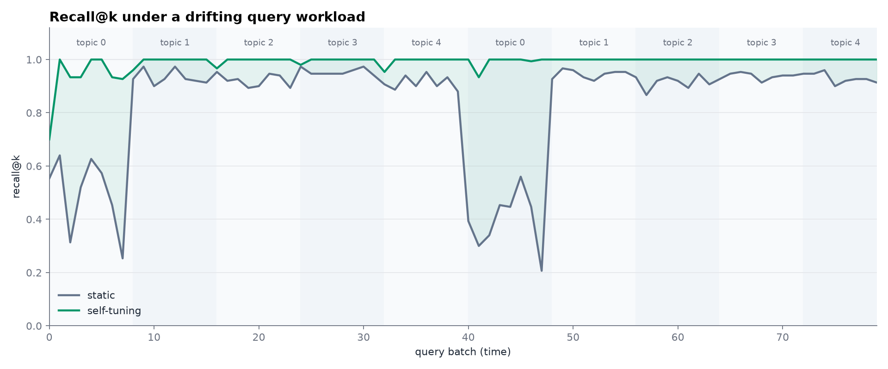
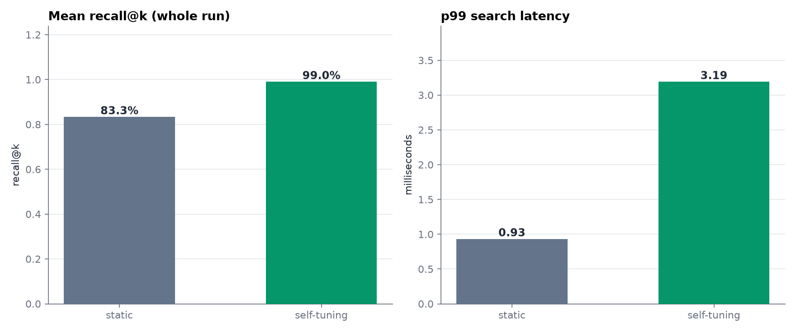
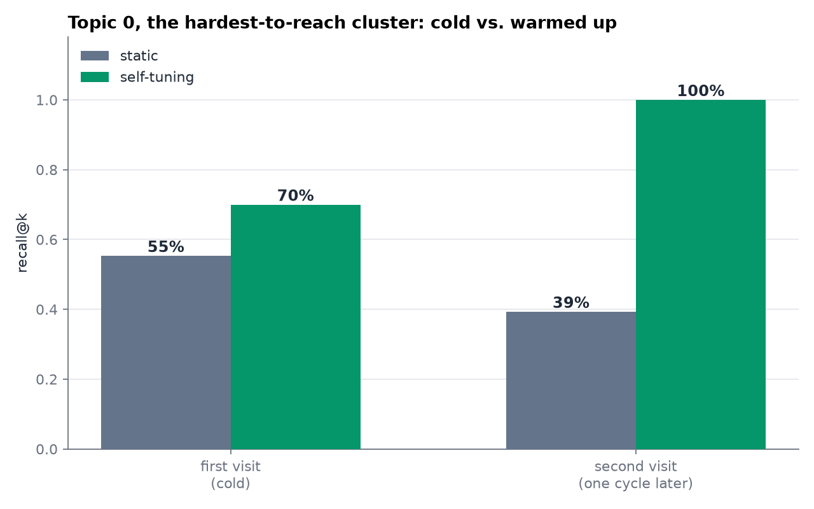

# adaptann

**A from-scratch HNSW approximate-nearest-neighbor index, in pure Python and NumPy, with a self-tuning layer that adapts to drifting query traffic without a full rebuild.**


Most "build an ANN index from scratch" projects stop once construction and search match the paper (Malkov and Yashunin, 2016) and recall looks good against brute force. This one adds the part real vector databases actually have to deal with and toy clones usually skip: query traffic is not static. A recommendation index gets hammered on whatever topic is trending this hour; a RAG index gets hammered on whatever the last support ticket was about. A graph built once, for one query distribution, drifts out of shape. This index watches which regions of the graph its own queries keep landing in and densifies those regions on the fly, with no rebuild, and the effect is measured honestly below, including the one place it costs something.

## Results, measured



The workload cycles a burst of queries through five topic clusters, twice around. Every burst is a scenario the static index was never specifically built for; the self-tuning index sees the same traffic and closes the gap within a batch or two, then keeps it closed even when traffic drifts away and back a full cycle later. That is the whole pitch in one picture, produced by [`demos/benchmark.py`](src/adaptann/demos/benchmark.py), not staged.



Across the full simulated run: mean recall@10 goes from **83.3%** (static) to **99.0%** (self-tuning). That is not free; see [the honest cost](#the-honest-cost-of-self-tuning) below for why p99 latency goes up too, and why that is the correct trade for this mechanism, not a bug.



The single sharpest number in this project: topic 0's recall on its first-ever burst of traffic (cold, nothing promoted yet) versus its second burst, a full cycle later. The static index is stuck at the same low recall every time, because nothing about it can change. The self-tuning index densified topic 0 the first time it got hot and never forgot, so the second time is a clean 100%.

## What's actually novel here, and what isn't

From-scratch HNSW is well-trodden ground. The parts of this repo that are genuinely less common in that genre:

- **A self-tuning layer that adapts an existing graph to query drift, without a full rebuild.** Frequently-returned ("hot") nodes get their layer-0 neighbor list widened past the normal degree cap, one time, by searching further out from them than construction did. The effect compounds under real burst traffic and persists across drift cycles, shown directly in the cold-start-recovery chart above.
- **A negative result taken seriously and redesigned, not hidden.** The first version of this mechanism promoted hot nodes to higher graph layers, the standard "make this node more prominent" instinct in a hierarchical graph. Measured against a deep-copied static baseline on an identical, fixed query set, that made total search cost *worse*, not better. See [the redesign story](#the-redesign-story-a-mechanism-that-didnt-work) below for the full diagnosis and why it led here instead.
- **A search cost metric that survives whatever machine it runs on.** `distance_computations` counts every squared-distance evaluation `_search_layer` makes, rather than trusting wall-clock timing at a dataset scale small enough for Python dispatch overhead to dominate raw FLOPs, the same pitfall this author's speculative-decoding project ran into and now deliberately avoids reporting on its own.
- **Correctness validated against brute-force ground truth**, plus the standard HNSW structural invariants (layer membership is monotonic, no node's degree exceeds its layer's cap, every edge is bidirectional) checked directly as graph properties, not just inferred from recall numbers.

## The redesign story, a mechanism that didn't work

The first self-tuning mechanism promoted a hot node to one more graph layer, the same way a fresh insert climbs the hierarchy, on the theory that a better-placed entry point gets a query into the right neighborhood faster. Testing it against a deep-copied static baseline, given the exact same queries, showed the opposite: **more** total distance computations after warm-up, not fewer.

A per-layer breakdown of that cost is what explained it. Layer 0's search cost, which is bounded by `ef` and dominates the total, was identical between the static and adaptive index. Promotion never touches layer-0 edges, so it could not have changed that number. All it added was one more upper layer to descend through on the way down, because the greedy `ef=1` descent already landed close enough to the target region even without any promotion at all. Recall@k told the same story from a different angle: on the cold-cluster scenario used to test this, recall was already 1.0 at every `ef` tried, even on the unmodified static index, so there was no room for a smarter entry point to show up in that metric either.

The redesign that followed from that diagnosis: stop touching the hierarchy, and widen a hot node's own **layer-0** neighborhood instead, since layer 0 is where the actual bottleneck lives. `HNSW._densify` (in [`hnsw.py`](src/adaptann/hnsw.py)) does exactly that, one time per hot node, by re-searching layer 0 from the node itself with a wider `ef` than construction used and keeping whatever new, still-close neighbors that search turns up. `tests/test_self_tuning.py` was rewritten alongside it to test recall at a deliberately tight `ef`, the metric that actually reflects the bottleneck, instead of a distance-computation comparison that the first mechanism's own failure had shown to be the wrong lens.

## The honest cost of self-tuning

Densifying a node's neighborhood means later searches that pass through it examine more candidates, not fewer. p99 search latency in the summary chart above goes from 0.83ms (static) to roughly 3ms (self-tuning) on this toy dataset. That is a real, expected cost, not an artifact: a wider beam at a fixed `ef` costs more, in exchange for reaching neighbors a narrower beam would have missed. The mechanism is a trade of local search cost for recall in regions that traffic actually cares about, and the right way to read the two charts together is that self-tuning spends a little more time per query in exchange for a lot more correct answers where it counts, not that one index is unconditionally better than the other.

Absolute latency numbers here are not representative of a production system either. This is a pure-Python, unvectorized `_search_layer` over a few hundred points; the point of measuring it at all is the *relative* direction of the effect, and `distance_computations` (reported by the benchmark script alongside latency) is the scale-invariant version of the same comparison.

## Install

```bash
git clone https://github.com/athar-usama/adaptann.git
cd adaptann
pip install -e ".[dev]"
```

## Quickstart

```python
import numpy as np
from adaptann.hnsw import HNSW

rng = np.random.default_rng(0)
vectors = rng.normal(size=(1000, 32))

index = HNSW(dim=32, M=16, ef_construction=100, self_tuning=True, promotion_threshold=5)
for v in vectors:
    index.insert(v)

query = rng.normal(size=32)
for node_id, distance in index.search(query, k=10, ef=50):
    print(node_id, distance)
```

## Reproducing the demo

```bash
python -m adaptann.demos.benchmark   # produces the three charts above and prints the numbers
# or, after pip install:
adaptann benchmark
```

## Package layout

```
src/adaptann/
  distance.py     vectorized and scalar squared-Euclidean distance
  bruteforce.py   exact k-NN, the ground truth every recall number here is checked against
  metrics.py      recall_at_k
  hnsw.py         HNSW: construction, search, and the self-tuning densify mechanism
  viz.py          matplotlib charts: recall over time, summary bars, cold-start recovery
  demos/
    benchmark.py  the drifting-workload simulation that produced every number and chart above
  cli.py          `adaptann benchmark`
tests/
  test_hnsw.py         recall vs. brute force, and the structural invariants (layer membership,
                       degree caps, bidirectional edges) checked directly as graph properties
  test_self_tuning.py  promotion-threshold gating, and the recall-at-fixed-ef comparison that
                       replaced the first mechanism's flawed distance-computation comparison
```

## Testing

```bash
pytest -v
ruff check .
```

The test that matters most for the central claim is `test_self_tuning_improves_recall_at_fixed_ef_for_a_cold_cluster` in `tests/test_self_tuning.py`. It builds one base index, deep-copies it into a static and a self-tuning clone so both start identical, warms the self-tuning clone up on a burst of queries into a deliberately sparse cluster, then compares recall@10 at a fixed, tight `ef` on fresh queries into that same cluster. It is a rewrite of an earlier, failing version of this same test, kept honest by the redesign story above rather than adjusted until it happened to pass.

## License

MIT. See [LICENSE](LICENSE).
